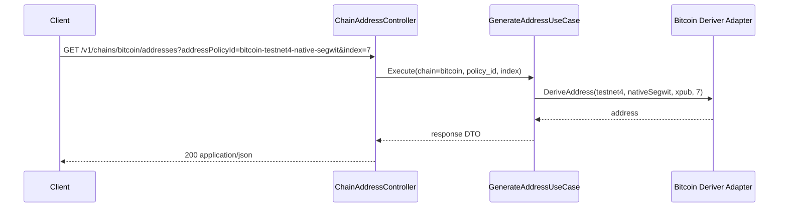

# Technical Design

## High-level approach

- Summary:
  - Move to chain-scoped routes under `/v1/chains/{chain}`.
  - Introduce policy-driven interfaces via `addressPolicyId`.
  - Add policy listing endpoint and policy-aware derivation endpoint.
  - Keep bitcoin xpub enablement through compose override files.
- Key decisions:
  - `addressPolicyId` is the caller-facing selector; network internals are not direct query params anymore.
  - Supported scheme values are `legacy`, `segwit`, `nativeSegwit`, and `taproot`.
  - Derivation path is selected by provided xpub depth:
    - depth <= 3 is treated as account-level xpub and derives external branch first (`/0/index`).
    - depth >= 4 is treated as change-level-or-deeper xpub and derives direct `index`.
  - Value-object parsers use case-insensitive map lookup for stable input normalization.
  - Policy list includes `minorUnit` and `decimals` so clients can format amounts safely without hard-coding chain metadata.
  - Policy list includes `enabled` state so clients can discover readiness.
  - Chain-specific path is designed for future chain expansion while implementing `bitcoin` first.

## System context

- Components:
  - Inbound adapter: chain address controller.
  - Application: list policies use case and generate address use case.
  - Outbound port: Bitcoin address deriver.
  - Outbound adapter: HD xpub derivation with scheme-specific address encoders.
  - DI assembles scheme encoders (`legacy`, `segwit`, `nativeSegwit`, `taproot`) and injects into deriver; deriver builds in-memory scheme lookup map.
  - Bootstrap/DI: builds policy catalog from static policy IDs + env xpub values.
  - Compose overrides: inject per-network per-scheme xpub env vars.
  - Swagger deployment mounts `deployments/swagger/` directory instead of a single `openapi.yaml` file to avoid stale bind-mount inode after formatter/atomic rewrite.
- Interfaces:
  - `GET /v1/chains/{chain}/address-policies`
  - `GET /v1/chains/{chain}/addresses?addressPolicyId=<id>&index=<uint32>`
  - Swagger UI spec URL: `/specs/openapi.yaml`

## Key flows

- Flow 1: List policies
  - Client requests `/v1/chains/bitcoin/address-policies`.
  - Controller validates path/method.
  - Use case returns policy metadata and enabled flags.
  - Controller returns `200` JSON list.
- Flow 2: Generate address
  - Client requests `/v1/chains/bitcoin/addresses` with `addressPolicyId` and `index`.
  - Controller validates input.
  - Use case resolves policy and checks enabled state.
  - Use case calls deriver with policy network/scheme/xpub/index.
  - Deriver decides whether to insert external branch `0` based on xpub depth before address index derivation.
  - Controller returns `200` with derived address.
- Flow 3: Error mapping
  - Unknown policy -> `400`.
  - Disabled policy -> `501`.
  - Unsupported chain/path -> `404`.
  - Invalid input -> `400`.

## Diagrams (optional)

- Mermaid sequence / flow:



## Data model

- Entities:
  - `Chain` value object (currently `bitcoin`).
  - `BitcoinNetwork` value object (`mainnet`, `testnet4`).
  - `BitcoinAddressScheme` value object (`legacy`, `segwit`, `nativeSegwit`, `taproot`).
  - `AddressPolicyConfig` catalog entry (`addressPolicyId`, `chain`, `network`, `scheme`, `minorUnit`, `decimals`, `xpub`).
- Schema changes or migrations:
  - None.
- Consistency and idempotency:
  - Derivation is deterministic and side-effect free.

## API or contracts

- Endpoints or events:
  - `GET /v1/chains/{chain}/address-policies`
  - `GET /v1/chains/{chain}/addresses?addressPolicyId=<id>&index=<uint32>`
- Request/response examples:

```http
GET /v1/chains/bitcoin/address-policies
```

```json
{
  "chain": "bitcoin",
  "addressPolicies": [
    {
      "addressPolicyId": "bitcoin-mainnet-legacy",
      "chain": "bitcoin",
      "network": "mainnet",
      "scheme": "legacy",
      "minorUnit": "satoshi",
      "decimals": 8,
      "enabled": true
    }
  ]
}
```

```http
GET /v1/chains/bitcoin/addresses?addressPolicyId=bitcoin-mainnet-native-segwit&index=12
```

```json
{
  "addressPolicyId": "bitcoin-mainnet-native-segwit",
  "chain": "bitcoin",
  "network": "mainnet",
  "scheme": "nativeSegwit",
  "minorUnit": "satoshi",
  "decimals": 8,
  "index": 12,
  "address": "1ExampleAddress..."
}
```

## Backward compatibility (optional)

- API compatibility:
  - Health endpoint remains unchanged.
  - Bitcoin derivation path changed from BTC-specific route to chain-scoped route.
- Data migration compatibility:
  - Not applicable.

## Failure modes and resiliency

- Retries/timeouts:
  - No retry needed; derivation is in-process CPU work.
- Backpressure/limits:
  - Index is validated to non-hardened uint32 range.
- Degradation strategy:
  - Disabled policy remains discoverable in list endpoint and derivation returns `501`.

## Observability

- Logs:
  - Existing app logs remain primary local troubleshooting source.
- Metrics:
  - Not added in this iteration.
- Traces:
  - Not added in this iteration.
- Alerts:
  - Not in scope for local development.

## Security

- Authentication/authorization:
  - Not added in this iteration.
- Secrets:
  - Only xpub values are consumed; no private keys are stored.
- Abuse cases:
  - Endpoint is public in local stack; no rate-limit in this version.

## Alternatives considered

- Option A:
  - Keep `/btc/...` routes and extend later.
- Option B:
  - Move now to `/v1/chains/{chain}/...` with bitcoin first.
- Why chosen:
  - Option B avoids future breaking route migrations and keeps contract expansion clear.

## Risks

- Risk:
  - Clients still calling old `/btc/address` route will break.
- Mitigation:
  - Update OpenAPI and documentation immediately with chain-scoped endpoints.
- Risk:
  - Misconfigured xpub causes runtime derivation errors.
- Mitigation:
  - Explicit `enabled` status and clear `501/500` response paths.
