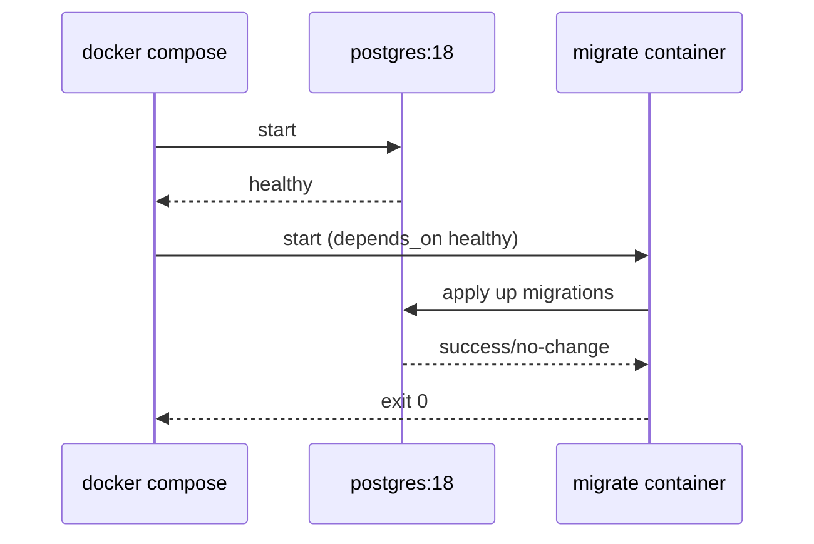

# Technical Design

## High-level approach

- Summary:
  - Add `postgres` service (v18) with healthcheck and persistent volume.
  - Add versioned SQL migrations under deployment folder.
  - Implement `cmd/migrate` executable using golang-migrate.
  - Add dedicated `migrate` compose service/container that runs post-DB health.
- Key decisions:
  - Keep migration orchestration separate from main app binary.
  - Use run-once migration container with explicit dependency ordering.

## System context

- Components:
  - `postgres` service (`postgres:18`)
  - `migrate` service (Go binary image)
  - SQL migration files mounted/copied into migrate runtime image
  - Existing `app` and `swagger` services
- Interfaces:
  - `migrate` -> `postgres` via connection string `postgres://...@postgres:5432/...`
  - `docker compose up` orchestrates sequence by health conditions

## Key flows

- Flow 1: Local startup
  - `make up` launches services.
  - `postgres` initializes and becomes healthy.
  - `migrate` container starts and runs `cmd/migrate up`.
- Flow 2: Migration command behavior
  - Command loads `DATABASE_URL` and `MIGRATIONS_SOURCE` env.
  - Runs `m.Up()`.
  - Treats `ErrNoChange` as success.

## Diagrams (optional)

- Mermaid sequence / flow:

## Data model

- Entities:
  - Baseline table for schema bootstrap verification (`service_metadata`).
- Schema changes or migrations:
  - `000001_init.up.sql` creates baseline table.
  - `000001_init.down.sql` drops baseline table.
- Consistency and idempotency:
  - Up migration uses deterministic DDL.
  - Runner treats no-change as success for repeat startups.

## API or contracts

- Endpoints or events:
  - Not applicable.
- Request/response examples:
  - Not applicable.

## Backward compatibility (optional)

- API compatibility:
  - Existing HTTP API behavior unchanged.
- Data migration compatibility:
  - Initial migration only; no prior schema compatibility concerns.

## Failure modes and resiliency

- Retries/timeouts:
  - Runner start gated by DB healthcheck to reduce connection races.
- Backpressure/limits:
  - Not applicable for local bootstrap.
- Degradation strategy:
  - Migration failures stop runner and surface in compose logs.

## Observability

- Logs:
  - `docker compose ... logs migrate` for migration status.
  - `docker compose ... logs postgres` for DB readiness issues.
- Metrics:
  - Not added.
- Traces:
  - Not added.
- Alerts:
  - Not added (local scope).

## Security

- Authentication/authorization:
  - Local DB auth via compose env credentials.
- Secrets:
  - Dev-only credentials; no production secret handling in scope.
- Abuse cases:
  - DB port exposed for local use; scope confined to development machine.

## Alternatives considered

- Option A:
  - Use official `migrate/migrate` image directly.
- Option B:
  - Implement Go command in `cmd/` and run it in dedicated container.
- Why chosen:
  - User explicitly requires command in `cmd/` and decoupling from main program.

## Risks

- Risk:
  - Startup ordering race if healthcheck is misconfigured.
- Mitigation:
  - Use explicit `depends_on` health condition and validate with compose smoke run.
