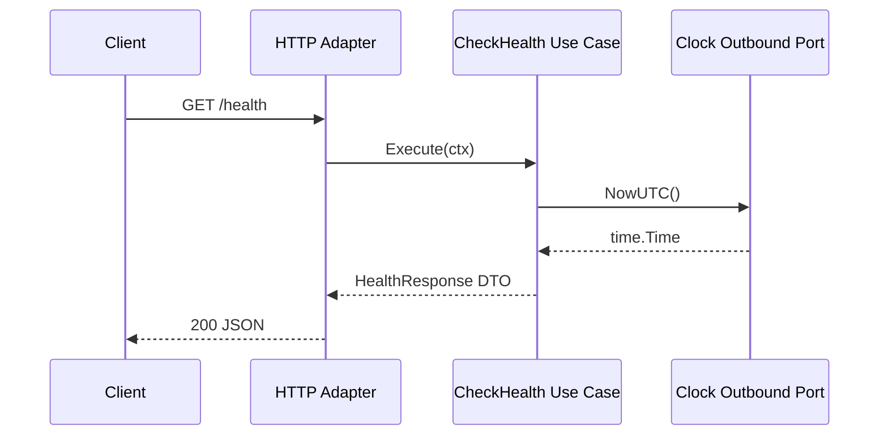

# Technical Design

## High-level approach

- Summary:
  - Establish three baseline assets in one pass:
    - Spec package under `specs/2026-03-03-project-bootstrap-standards/`.
    - Root `AGENTS.md` with embedded skill guidance and project policy.
    - Go bootstrap implementation using `cmd/` + `internal/` clean hexagonal layering.
  - Add pre-commit config and support scripts, then validate locally.
- Key decisions:
  - Choose Full mode because this baseline introduces architecture, toolchain workflow, and quality gates.
  - Keep single-module Go repository (`go.mod` at root).
  - Keep single service binary `cmd/payrune/main.go`.

## System context

- Components:
  - `cmd/payrune`: executable bootstrap.
  - `internal/bootstrap`: application start/shutdown orchestration.
  - `internal/infrastructure/di`: dependency wiring.
  - `internal/application`: use case and ports.
  - `internal/domain`: pure business value objects.
  - `internal/adapters`: inbound HTTP and outbound system adapters.
- Interfaces:
  - Inbound HTTP: `GET /health`.
  - Outbound system interface: clock provider port.

## Key flows

- Flow 1: Health request
  - HTTP adapter validates method.
  - Adapter maps call to inbound use case port.
  - Use case reads current time from outbound clock port.
  - Use case returns response DTO.
  - Adapter maps DTO to HTTP JSON.
- Flow 2: Startup
  - `main` creates cancellable context from signals.
  - Bootstrap builds container and routes.
  - Server starts and performs graceful shutdown on context cancel.

## Diagrams (optional)

- Mermaid sequence / flow:



## Data model

- Entities:
  - None for bootstrap (no aggregate persistence yet).
  - Domain value object `ServiceStatus` with value `up`.
- Schema changes or migrations:
  - None.
- Consistency and idempotency:
  - Endpoint is read-only and idempotent.

## API or contracts

- Endpoints or events:
  - `GET /health` -> `200` body `{ "status": "up", "timestamp": "RFC3339" }`
  - `POST/PUT/DELETE /health` -> `405`.
- Request/response examples:

```http
GET /health HTTP/1.1
Host: localhost:8080
```

```json
{
  "status": "up",
  "timestamp": "2026-03-03T11:00:00Z"
}
```

## Backward compatibility (optional)

- API compatibility:
  - Initial version; no backward-compat constraints yet.
- Data migration compatibility:
  - Not applicable.

## Failure modes and resiliency

- Retries/timeouts:
  - No external dependencies; retries not required.
- Backpressure/limits:
  - Default `net/http` behavior only for bootstrap stage.
- Degradation strategy:
  - On serialization or use-case error, return `500` with generic message.

## Observability

- Logs:
  - Startup failure logs via standard logger in `main`.
- Metrics:
  - Not implemented in bootstrap.
- Traces:
  - Not implemented in bootstrap.
- Alerts:
  - Not implemented in bootstrap.

## Security

- Authentication/authorization:
  - Not required for public health endpoint.
- Secrets:
  - No secret material in code; pre-commit enforces private-key detection.
- Abuse cases:
  - Unsupported methods rejected with `405`.

## Alternatives considered

- Option A:
  - Keep only docs/config and skip bootstrap code.
- Option B:
  - Add minimal compile-ready bootstrap code now.
- Why chosen:
  - Option B gives immediate executable validation for architecture and hook pipeline.

## Risks

- Risk:
  - `golangci-lint` or hook repository updates can introduce unexpected failures.
- Mitigation:
  - Pin hook versions in config and keep bootstrap code minimal and lint-clean.
