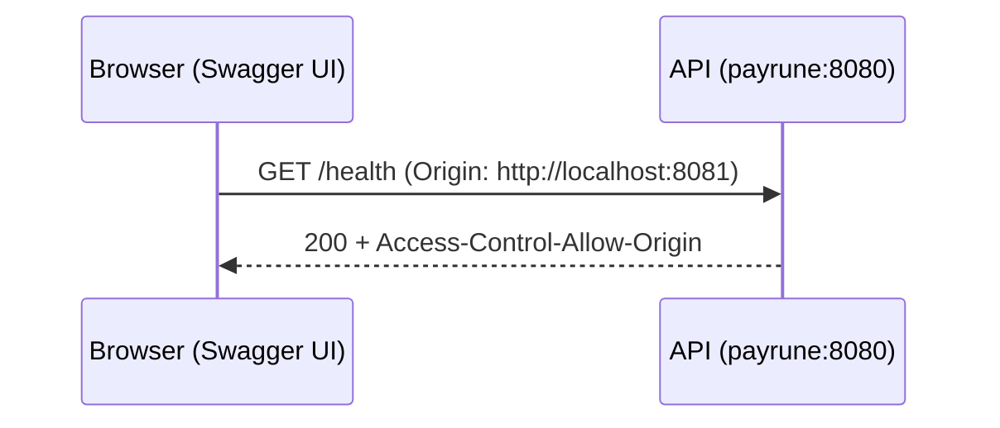

# Technical Design

## High-level approach

- Summary:
  - Keep Swagger UI container serving docs on `8081`.
  - Update OpenAPI server URL to `http://localhost:8080` so Swagger requests directly hit payrune.
  - Add CORS middleware in inbound HTTP stack to allow origin `http://localhost:8081`.
- Key decisions:
  - Use explicit origin allow list (single origin) instead of wildcard.
  - Handle preflight (`OPTIONS`) in middleware to avoid contaminating endpoint handlers.

## System context

- Components:
  - `payrune` service on `localhost:8080`.
  - `swagger` UI service on `localhost:8081`.
  - OpenAPI YAML mounted into swagger container.
- Interfaces:
  - Browser -> Swagger UI (`8081`)
  - Browser -> API (`8080`) as cross-origin request

## Key flows

- Flow 1: Swagger UI load
  - User opens `http://localhost:8081` and UI reads mounted OpenAPI document.
- Flow 2: Try-it-out direct call
  - Swagger issues `GET http://localhost:8080/health` from browser.
  - API CORS middleware validates origin and adds allow headers.
  - Browser accepts response and shows payload in Swagger UI.

## Diagrams (optional)

- Mermaid sequence / flow:



## Data model

- Entities:
  - Health response `{status, timestamp}` unchanged.
- Schema changes or migrations:
  - None.
- Consistency and idempotency:
  - `GET /health` remains idempotent.

## API or contracts

- Endpoints or events:
  - `GET /health`
- Request/response examples:

```json
{
  "status": "up",
  "timestamp": "2026-03-03T04:17:19Z"
}
```

## Backward compatibility (optional)

- API compatibility:
  - Endpoint path and payload unchanged.
- Data migration compatibility:
  - Not applicable.

## Failure modes and resiliency

- Retries/timeouts:
  - No retry added; errors surfaced directly in UI.
- Backpressure/limits:
  - Not in scope.
- Degradation strategy:
  - If CORS headers missing, browser blocks response; logs and curl headers provide diagnosis.

## Observability

- Logs:
  - `docker compose ... logs payrune` and `... logs swagger`.
- Metrics:
  - None added.
- Traces:
  - None added.
- Alerts:
  - None for local scope.

## Security

- Authentication/authorization:
  - Not in scope.
- Secrets:
  - No secrets introduced.
- Abuse cases:
  - CORS origin restricted to local swagger origin only.

## Alternatives considered

- Option A:
  - Keep swagger-side proxy (`/api`) and avoid CORS.
- Option B:
  - Direct call to 8080 with API-side CORS handling.
- Why chosen:
  - User explicitly requires direct 8080 calls from Swagger.

## Risks

- Risk:
  - Overly strict origin policy may block alternate local ports.
- Mitigation:
  - Centralize middleware to adjust origin list in one location.
