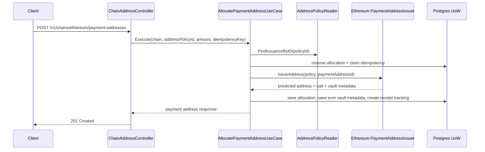
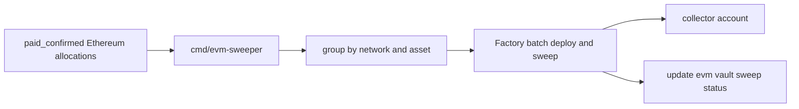

# Technical Design

## High-level approach

- Summary:
  - Add `ethereum` as a supported chain with asset-aware policies for ETH and USDT.
  - Replace the xpub-shaped issuance dependency in payment allocation with a generic
    chain-specific issuer abstraction.
  - Model Ethereum payment addresses as counterfactual deposit vaults predicted from a factory plus
    random salt, then swept later only when the operator runs `cmd/evm-sweeper`.
  - Extend receipt tracking so observations are asset-aware and can distinguish native ETH from
    ERC20 USDT.
  - Keep Bitcoin's current derivation flow behind the same high-level allocation contract.
- Key decisions:
  - Use one deposit-vault factory per Ethereum network and one collector account per policy group.
  - Use cryptographically random salts rather than sequential derivation indexes for Ethereum.
  - Use counterfactual CREATE2/clone addresses so allocation stays fast and does not require an
    on-chain deployment at issuance time.
  - Persist EVM vault metadata in a dedicated technical store linked by `payment_address_id` rather
    than forcing it into xpub-specific columns.
  - Keep `GET /v1/chains/{chain}/addresses` as a deterministic derivation/debug endpoint and do not
    extend it to Ethereum random-address issuance.
  - Use an explorer/indexer-backed Ethereum observer because raw JSON-RPC alone is not a good fit
    for enumerating native incoming transfers by address.

## System context

- Components:
  - Inbound HTTP:
    - Existing chain-scoped policy listing and payment-address allocation/status endpoints.
  - Application:
    - `ListAddressPoliciesUseCase`
    - refactored `AllocatePaymentAddressUseCase`
    - existing `RunReceiptPollingCycleUseCase` with asset-aware observer input
    - new `RunEVMSweepUseCase` for manual command execution
  - Domain:
    - Existing payment allocation and receipt lifecycle rules
    - new asset snapshot value objects and issuance-method normalization
  - Outbound adapters:
    - `bitcoin` keeps xpub derivation for deterministic Bitcoin issuance
    - new `ethereum` package predicts counterfactual vault addresses, observes ETH/ERC20 transfers,
      and executes sweeps
    - postgres persistence gains an EVM factory registry, an EVM vault store, and asset snapshot
      columns
  - Infrastructure/DI:
    - network-specific env for Ethereum providers, relayer keys, and token contracts
    - active factory/collector generations are loaded from the database for issuance and sweep
    - dedicated `cmd/evm-factory-deploy` bootstrap for one-shot factory deployment plus DB
      registration
    - dedicated `cmd/evm-sweeper` bootstrap for relayer credentials and command filters
    - base Compose keeps the mainnet collector default in `compose.yaml`, while factory addresses
      are produced by `cmd/evm-factory-deploy` and then persisted into `evm_factories`
    - the local overlay keeps Sepolia-only test defaults in `compose.test.yaml` / `compose.test.env`
      for operators who want to run the deploy command against Sepolia
- Interfaces:
  - Public HTTP:
    - `GET /v1/chains/{chain}/address-policies`
    - `POST /v1/chains/{chain}/payment-addresses`
    - `GET /v1/chains/{chain}/payment-addresses/{paymentAddressId}`
  - Internal command:
    - `cmd/evm-factory-deploy`
    - `cmd/evm-sweeper`
    - `RegisterEVMFactoryUseCase.Execute`
    - `RunEVMSweepUseCase.Execute`
  - Ethereum outbound integrations:
    - explorer/indexer API for native and token transfer observation
    - JSON-RPC or wallet client for sweep transaction submission
    - deposit-vault factory contract on mainnet and Sepolia

## Key flows

- Flow 1: Allocate Ethereum payment address
  - Client calls `POST /v1/chains/ethereum/payment-addresses` with an Ethereum policy such as
    `ethereum-mainnet-eth` or `ethereum-sepolia-usdt`.
  - Controller validates request and idempotency key as today.
  - Application loads the asset-aware issuance policy.
  - Application loads the active factory registration for the target network from the EVM factory
    registry store.
  - Application reserves a generic payment allocation row inside the current unit-of-work.
  - Ethereum issuer generates a 32-byte random salt via `crypto/rand`.
  - Ethereum issuer predicts the vault address from `(factory, implementation/init-code-hash,
salt, collector config)` and persists an `evm_payment_vaults` record linked to
    `payment_address_id`.
  - Allocation is completed with:
    - `chain=ethereum`
    - `network=mainnet|sepolia`
    - `scheme=create2_forwarder`
    - `address=<predicted vault address>`
    - immutable asset snapshot fields
  - Receipt tracking is created with immutable asset snapshot and network confirmation settings.
  - Response returns `201 Created` with the allocated address and asset metadata.
- Flow 2: Observe ETH payment
  - Poller claims due Ethereum receipt trackings.
  - Observer fetches latest block height once per `(chain, network)`.
  - For `assetType=native`, observer queries the configured provider for native transfers or
    address balance deltas since `issuedAt` / `lastObservedBlockHeight`.
  - Observer computes:
    - `observedTotalMinor`
    - `confirmedTotalMinor`
    - `unconfirmedTotalMinor`
      using the configured confirmation depth.
  - Receipt lifecycle policy updates status as with Bitcoin.
- Flow 3: Observe USDT payment
  - Poller claims due Ethereum USDT receipt trackings.
  - Observer queries ERC20 `Transfer` activity for the configured token contract and destination
    address.
  - Confirmed and unconfirmed totals are derived from transfer block numbers relative to the
    latest block height and required confirmations.
  - Status transitions reuse the existing lifecycle policy.
- Flow 4: Deploy and register one factory
  - Operator runs `cmd/evm-factory-deploy --network=sepolia` or
    `cmd/evm-factory-deploy --network=mainnet`.
  - The command loads RPC URL, deploy private key, collector address, confirmation target, and
    optional manifest output path from env or explicit flags.
  - The command checks whether the selected network already has an active factory in
    `evm_factories`.
  - If an active row already exists and the operator did not pass `--replace-active`, the command
    fails before sending a deployment transaction.
  - The deploy adapter loads the compiled `DepositVaultFactory` artifact, deploys the contract,
    waits for the requested confirmations, reads `vaultCreationCodeHash`, and emits a deployment
    manifest JSON file when an output path is configured.
  - The command then registers the deployment into `evm_factories` in one DB transaction and marks
    the previous row as `retired` only when `--replace-active` was explicitly allowed.
  - If on-chain deployment succeeds but DB registration fails, the operator can rerun the same
    command with `--deployment-manifest=<path>` to register the existing deployment without
    spending gas twice.
- Flow 5: Manual batch sweep ETH/USDT
  - Operator runs `cmd/evm-sweeper` with explicit filters such as `network`, `assetCode`,
    `paymentAddressId`, `beforeIssuedAt`, or default eligible selection rules.
  - Command loads the active factory registration for the selected network from the database and
    combines it with RPC/relayer secrets from env.
  - Command selects eligible vault rows, typically `paid_confirmed` receipts not yet swept.
  - Command groups rows by `(network, assetType, tokenAddress, collectorAddress)`.
  - Ethereum sweep adapter submits a batch call to the network-specific factory:
    - deploy vault if not already deployed
    - sweep ETH balance or ERC20 balance to collector
  - Command persists sweep tx hash plus per-vault sweep status.
  - Failures remain retryable with bounded batch sizes.

## Diagrams (optional)

- Mermaid sequence / flow:





## Data model

- Entities:
  - `AddressPolicy` gains immutable asset metadata:
    - `assetCode` such as `eth` or `usdt`
    - `assetType` such as `native` or `erc20`
    - `tokenAddress` for ERC20 policies
    - `issuanceMethod` such as `xpub_derivation` or `create2_forwarder`
  - `PaymentAddressAllocation` stores a snapshot of the selected asset metadata together with the
    issued address.
  - `PaymentReceiptTracking` stores the same asset snapshot so observation remains stable if config
    changes later.
  - EVM vault state is treated as technical process persistence, not as a domain entity with rich
    business behavior.
- Schema changes or migrations:
  - Add `evm_factories` table for operator-managed factory generations:

```text
evm_factories
  id BIGSERIAL PRIMARY KEY
  network TEXT NOT NULL
  factory_address TEXT NOT NULL UNIQUE
  collector_address TEXT NOT NULL
  status TEXT NOT NULL CHECK (status IN ('active', 'retired'))
  deployment_tx_hash TEXT
  deployed_at TIMESTAMPTZ
  created_at TIMESTAMPTZ NOT NULL DEFAULT NOW()
  updated_at TIMESTAMPTZ NOT NULL DEFAULT NOW()

UNIQUE INDEX evm_factories_one_active_per_network
  ON evm_factories (network)
  WHERE status = 'active'
```

- Extend `address_policy_allocations` with immutable asset snapshot columns:
  - `asset_code TEXT NOT NULL`
  - `asset_type TEXT NOT NULL`
  - `token_address TEXT`
  - `issuance_method TEXT NOT NULL`
- Extend `payment_receipt_trackings` with the same immutable asset snapshot columns.
- Add `evm_payment_vaults` table:

```text
evm_payment_vaults
  payment_address_id BIGINT PRIMARY KEY REFERENCES address_policy_allocations(id)
  network TEXT NOT NULL
  factory_id BIGINT NOT NULL REFERENCES evm_factories(id)
  factory_address TEXT NOT NULL
  collector_address TEXT NOT NULL
  token_address TEXT
  salt_hex TEXT NOT NULL UNIQUE
  predicted_address TEXT NOT NULL UNIQUE
  deploy_status TEXT NOT NULL CHECK (deploy_status IN ('predicted', 'deployed'))
  sweep_status TEXT NOT NULL CHECK (sweep_status IN ('pending', 'submitted', 'succeeded', 'failed'))
  deploy_tx_hash TEXT
  last_sweep_tx_hash TEXT
  last_sweep_error TEXT
  created_at TIMESTAMPTZ NOT NULL DEFAULT NOW()
  updated_at TIMESTAMPTZ NOT NULL DEFAULT NOW()
```

- Keep current Bitcoin xpub cursor/allocation columns intact for backward compatibility in this
  phase.
- Consistency and idempotency:
  - `(chain, idempotency_key)` remains the public idempotency guard.
  - `salt_hex` and `predicted_address` are additionally unique in `evm_payment_vaults`.
  - Asset snapshot is copied into allocation and tracking records so future config edits cannot
    rewrite historical observations.
  - Active factory selection is stored in `evm_factories`, so replacing the active collector or
    factory does not break old vaults; old rows become `retired` but remain available for sweeping
    existing addresses.
  - Sweep retries are safe because the command stores per-vault sweep status and tx hashes.

## API or contracts

- Endpoints or events:
  - Existing endpoints remain:
    - `GET /v1/chains/{chain}/address-policies`
    - `POST /v1/chains/{chain}/payment-addresses`
    - `GET /v1/chains/{chain}/payment-addresses/{paymentAddressId}`
  - Manual sweep command:
    - `cmd/evm-sweeper`
  - Manual deploy/register command:
    - `cmd/evm-factory-deploy`
  - Existing deterministic address endpoint remains Bitcoin-oriented:
    - `GET /v1/chains/{chain}/addresses` returns `501` or chain-not-supported semantics for
      Ethereum issuance because Ethereum allocation is intentionally random and policy-driven.
  - Ethereum contracts:
    - `DepositVaultFactory`
    - `DepositVault` implementation or minimal-clone target
- Request/response examples:

```http
GET /v1/chains/ethereum/address-policies
```

```json
{
  "chain": "ethereum",
  "addressPolicies": [
    {
      "addressPolicyId": "ethereum-mainnet-eth",
      "chain": "ethereum",
      "network": "mainnet",
      "scheme": "create2_forwarder",
      "assetCode": "eth",
      "assetType": "native",
      "minorUnit": "wei",
      "decimals": 18,
      "tokenAddress": "",
      "enabled": true
    },
    {
      "addressPolicyId": "ethereum-mainnet-usdt",
      "chain": "ethereum",
      "network": "mainnet",
      "scheme": "create2_forwarder",
      "assetCode": "usdt",
      "assetType": "erc20",
      "minorUnit": "microUsdt",
      "decimals": 6,
      "tokenAddress": "0xdAC17F958D2ee523a2206206994597C13D831ec7",
      "enabled": true
    }
  ]
}
```

```http
POST /v1/chains/ethereum/payment-addresses
Idempotency-Key: order-20260315-10001
Content-Type: application/json

{
  "addressPolicyId": "ethereum-mainnet-usdt",
  "expectedAmountMinor": 125000000,
  "customerReference": "invoice-10001"
}
```

```json
{
  "paymentAddressId": "841",
  "addressPolicyId": "ethereum-mainnet-usdt",
  "expectedAmountMinor": 125000000,
  "chain": "ethereum",
  "network": "mainnet",
  "scheme": "create2_forwarder",
  "assetCode": "usdt",
  "assetType": "erc20",
  "minorUnit": "microUsdt",
  "decimals": 6,
  "tokenAddress": "0xdAC17F958D2ee523a2206206994597C13D831ec7",
  "address": "0x1234...abcd",
  "customerReference": "invoice-10001"
}
```

```solidity
interface IDepositVaultFactory {
    function predictVaultAddress(bytes32 salt) external view returns (address);
    function batchDeployAndSweepNative(bytes32[] calldata salts) external;
    function batchDeployAndSweepToken(bytes32[] calldata salts, address token) external;
}
```

```text
cmd/evm-sweeper \
  --network=sepolia \
  --asset-code=usdt \
  --before-issued-at=2026-03-16T00:00:00Z \
  --batch-size=50
```

## Backward compatibility (optional)

- API compatibility:
  - Bitcoin routes and payment status contracts stay available.
  - Public DTOs gain additive asset fields; existing JSON fields remain stable.
  - `GET /v1/chains/{chain}/addresses` is not generalized to Ethereum random issuance.
- Data migration compatibility:
  - Existing Bitcoin rows remain valid with nullable `token_address` and new asset metadata backfill
    values derived from policy defaults.
  - New EVM vault table is additive and keyed by `payment_address_id`.

## Failure modes and resiliency

- Retries/timeouts:
  - Explorer/indexer calls use bounded timeouts and retry-on-transient-error behavior in the
    Ethereum observer.
  - Sweep submission retries are bounded and batch sizes are configurable.
- Backpressure/limits:
  - Sweep batches must cap vault count per transaction to stay below gas limits.
  - Poller uses bounded block-range queries and persisted checkpoints to avoid unbounded historical
    scans.
- Degradation strategy:
  - If explorer/indexer access fails, receipt tracking records `last_error` and reschedules.
  - If a sweep batch partially fails, only affected vault rows remain retryable; confirmed payment
    status remains untouched.
  - If Sepolia USDT token address is unset, the policy stays disabled rather than guessing a token.
  - If the operator does not run `cmd/evm-sweeper`, confirmed balances remain parked in their vault
    addresses with no impact on payment-status correctness.
  - If DB registration fails after deployment, the emitted manifest remains the recovery artifact
    for a later `cmd/evm-factory-deploy --deployment-manifest=...` run.

## Observability

- Logs:
  - Allocation logs include `chain`, `network`, `addressPolicyId`, `paymentAddressId`, and issuance
    method.
  - `cmd/evm-factory-deploy` logs include `network`, `collectorAddress`, `factoryAddress`,
    `deploymentTxHash`, `manifestPath`, and `replaceActive`.
  - `cmd/evm-sweeper` logs include `network`, `assetCode`, filters, batch size, tx hash, and
    failure reason.
- Metrics:
  - `payment_address_allocations_total{chain,network,asset_code}`
  - `receipt_poll_cycles_total{chain,network}`
  - `receipt_poll_errors_total{chain,network,provider}`
  - `evm_sweep_batches_total{network,asset_code,status}`
  - `evm_sweep_vaults_total{network,asset_code,status}`
- Traces:
  - Not required in the first slice; structured logs are sufficient.
- Alerts:
  - Alert on repeated command sweep failures, prolonged unswept confirmed balances, and sustained
    provider error rates.

## Security

- Authentication/authorization:
  - Public address-allocation endpoints remain unauthenticated unless the product layer adds auth
    separately.
  - Factory deployment is restricted to `cmd/evm-factory-deploy`, not public HTTP.
  - Sweep execution is restricted to `cmd/evm-sweeper`, not public HTTP.
- Secrets:
  - Collector/relayer private keys are not used by the public API container.
  - Mainnet and Sepolia deploy credentials are loaded only in `cmd/evm-factory-deploy` bootstrap
    code.
  - Mainnet and Sepolia relayer credentials are loaded only in `cmd/evm-sweeper` bootstrap code.
  - Factory and collector addresses are treated as operational configuration and stored in the
    database so multiple factory generations can coexist safely.
- Abuse cases:
  - User-supplied input must not control CREATE2 salt directly; the server generates it.
  - Contracts must restrict sweep execution to factory/owner roles and must not allow arbitrary
    recipient addresses at call time.
  - ERC20 interaction should use a safe wrapper because USDT-style tokens may not return a boolean
    from `transfer`.

## Alternatives considered

- Option A:
  - Derive Ethereum EOAs from HD/xpub material the same way Bitcoin does.
- Option B:
  - Deploy one deposit contract on-chain during every address-allocation request.
- Why chosen:
  - Neither option matches the operator goal:
    - Option A still creates one private key per deposit address and requires separate gas/fund
      management.
    - Option B makes issuance slow, costly, and externally dependent.
  - The chosen CREATE2/counterfactual vault pattern gives unique addresses, one collector account,
    deferred on-chain cost, and batch sweep.

## Risks

- Risk:
  - Explorer/indexer APIs differ across providers and may drift.
- Mitigation:
  - Hide provider specifics behind a small Ethereum observer port and keep network/provider config
    explicit.
- Risk:
  - Manual operation can delay treasury consolidation if the operator forgets to run the command.
- Mitigation:
  - Keep `sweep_status` visible, expose filterable command options, and alert on prolonged unswept
    confirmed balances.
- Risk:
  - A contract bug in address prediction or sweep logic can strand funds.
- Mitigation:
  - Add contract unit/integration tests, store bytecode hash or implementation address explicitly,
    and verify predicted addresses in tests before mainnet rollout.
- Risk:
  - The database active-factory registry can drift from the contracts actually used in production.
- Mitigation:
  - Provide an explicit sync command that imports deployment manifests into `evm_factories` and
    reject ambiguous multiple-active states at read time.
- Risk:
  - Testnet USDT behavior may not match mainnet USDT exactly.
- Mitigation:
  - Use a 6-decimal ERC20 test token and keep Sepolia token address configurable; reserve final
    mainnet USDT validation for integration testing.
