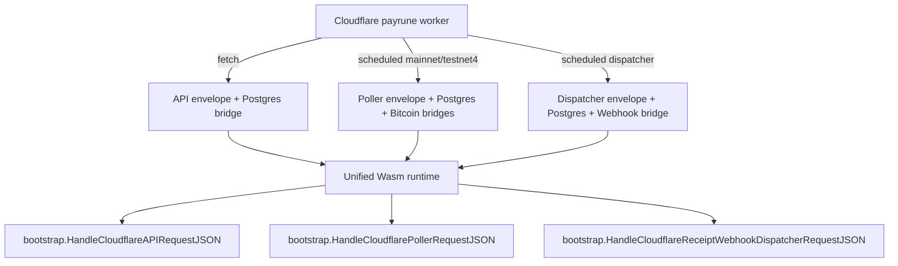

# Technical Design

## High-level approach

- Summary:
  - Replace the three separate Cloudflare deployment shells (`payrune-api`,
    `payrune-poller`, `payrune-webhook-dispatcher`) with one `payrune` worker shell that serves
    API traffic through `fetch()` and routes scheduled events through one `scheduled()` entrypoint.
  - Build one Go/Wasm binary for the unified worker and expose one JS-callable entrypoint that
    dispatches to the existing API, poller, and dispatcher bootstrap handlers.
  - Keep `receipt-webhook-mock` as a separate Cloudflare worker because it remains the explicit
    internal service-binding target for dispatcher delivery tests.
- Key decisions:
  - Keep runtime-specific bootstrap handlers in `internal/bootstrap`; merge deployment shells, not
    business logic.
  - Route scheduled jobs by exact cron-expression mapping inside the unified worker shell so the
    target runtime remains explicit.
  - Keep bridge registration path-specific so API requests do not initialize Bitcoin or webhook
    bridges unnecessarily.
  - Remove the legacy split Cloudflare deployment directories and lifecycle scripts once the unified
    worker is in place.

## System context

- Components:
  - `cmd/payrune-worker/`
    - Unified Go/Wasm entrypoint that accepts an operation key and payload, then delegates to the
      existing bootstrap handlers.
  - `internal/bootstrap/api_worker.go`
    - Existing API worker request orchestration.
  - `internal/bootstrap/poller_worker.go`
    - Existing poller worker request orchestration.
  - `internal/bootstrap/receipt_webhook_dispatcher_worker.go`
    - Existing dispatcher worker request orchestration.
  - `deployments/cloudflare/payrune/`
    - Unified Wrangler config, JS runtime shell, Go/Wasm loader, shared PostgreSQL bridge, Bitcoin
      observer bridge, webhook notifier bridge, and deployment-focused tests/docs.
  - `deployments/cloudflare/receipt-webhook-mock/`
    - Separate internal binding target for webhook dispatch tests and internal delivery flow.
- Interfaces:
  - Cloudflare `fetch()` for public API traffic.
  - Cloudflare `scheduled()` for mainnet poller, testnet4 poller, and dispatcher cycles.
  - PostgreSQL bridge interface.
  - Bitcoin observer bridge interface.
  - Webhook notifier service-binding bridge interface.

## Key flows

- Flow 1: Public API request

  1. Cloudflare invokes `fetch(request, env, ctx)` on the unified `payrune` worker.
  2. The worker rejects non-public paths and builds the existing API request envelope.
  3. The worker registers the PostgreSQL bridge only for the request scope.
  4. The unified Wasm runtime is invoked with operation `api`.
  5. Go delegates to `bootstrap.HandleCloudflareAPIRequestJSON(...)`.
  6. The JS shell maps the encoded API response envelope back to a `Response`.

- Flow 2: Scheduled poller cycle

  1. Cloudflare invokes `scheduled(controller, env, ctx)` with one of the configured poller cron
     expressions.
  2. The JS shell maps the cron expression to a poller job definition (`mainnet` or `testnet4`).
  3. The worker registers PostgreSQL and Bitcoin observer bridges.
  4. The worker augments the env snapshot with explicit poller scope (`POLL_CHAIN`, `POLL_NETWORK`)
     and network-specific Esplora settings.
  5. The unified Wasm runtime is invoked with operation `poller`.
  6. Go delegates to `bootstrap.HandleCloudflarePollerRequestJSON(...)` and the JS shell logs the
     existing poll summary.

- Flow 3: Scheduled webhook dispatcher cycle
  1. Cloudflare invokes `scheduled(controller, env, ctx)` with the dispatcher cron expression.
  2. The JS shell maps the cron expression to the dispatcher job definition.
  3. The worker registers PostgreSQL and webhook notifier bridges.
  4. The unified Wasm runtime is invoked with operation `webhook_dispatcher`.
  5. Go delegates to `bootstrap.HandleCloudflareReceiptWebhookDispatcherRequestJSON(...)`.
  6. The JS shell logs the existing dispatcher summary.

## Diagrams (optional)

- Mermaid sequence / flow:

## Data model

- Entities:
  - No domain entities change in this slice.
- Schema changes or migrations:
  - None.
- Consistency and idempotency:
  - Existing PostgreSQL claim/lease semantics and outbox semantics remain the source of truth.
  - Consolidation does not add cross-job shared mutable state beyond existing runtime env and
    bridge registration scopes.

## API or contracts

- Endpoints or events:
  - Public HTTP API routes remain unchanged.
  - The unified worker declares all scheduled cron expressions currently used for:
    - Bitcoin mainnet poller
    - Bitcoin testnet4 poller
    - Receipt webhook dispatcher
  - The Wasm JS bridge contract becomes:
    - operation key: `api | poller | webhook_dispatcher`
    - payload: existing JSON envelope for that runtime
- Request/response examples:
  - API requests keep the current Cloudflare API request envelope.
  - Poller requests keep the existing envelope fields and gain explicit env overrides from the cron
    job definition rather than from separate Wrangler envs.
  - Dispatcher requests keep the existing envelope fields.

## Backward compatibility (optional)

- API compatibility:
  - Preserved; no route or payload contract changes are introduced.
- Data migration compatibility:
  - Preserved; no schema change or migration sequencing change is required.

## Failure modes and resiliency

- Retries/timeouts:
  - Poller and dispatcher use-case retry, claim TTL, and timeout semantics remain unchanged.
- Backpressure/limits:
  - Existing batch-size and timeout vars remain configurable in the unified Wrangler config.
- Degradation strategy:
  - Unsupported cron expressions fail fast with a clear error and log entry.
  - Bridge registration is scoped so API requests do not depend on poller/dispatcher bridge setup.
  - A shared Wasm runtime failure still affects the unified worker by design because the service is
    now one deployment unit.

## Observability

- Logs:
  - Preserve current API error messages, poller summary messages, and dispatcher summary messages.
  - Add explicit log context when a scheduled cron expression is unmapped.
- Metrics:
  - Existing claimed/updated/sent/retried/failed counters remain the logical output metrics.
- Traces:
  - Not introduced in this slice.
- Alerts:
  - Existing Worker-log-based alerts continue to work once pointed at the unified payrune worker.

## Security

- Authentication/authorization:
  - Public access remains limited to the existing API fetch surface.
  - Scheduled jobs remain non-public runtime paths.
- Secrets:
  - One payrune worker secret sync flow now owns PostgreSQL, xpub, Esplora, and webhook secrets.
  - `receipt-webhook-mock` continues to own its webhook-secret sync flow separately.
- Abuse cases:
  - No new public endpoints are introduced.
  - Cron misrouting must not silently run a different job than the configured one.

## Alternatives considered

- Option A:
  - Keep the current split workers and accept the Cloudflare control-plane clutter.
- Option B:
  - Merge only poller and dispatcher, but keep API in a separate worker.
- Why chosen:
  - The operating model for this repository is one Cloudflare worker per backend service where
    practical, and maintainers explicitly want payrune to deploy as one service unit.

## Risks

- Risk:
  - Cron-expression-based routing could drift from the values configured in `wrangler.toml`.
- Mitigation:
  - Keep cron expressions in explicit constants and cover routing behavior with JS tests.
- Risk:
  - A top-level runtime loader or shared import failure in the unified worker would affect API and
    scheduled jobs together.
- Mitigation:
  - Keep runtime-specific bridge setup inside `fetch()` and `scheduled()` paths instead of doing
    heavy shared initialization at module load.
- Risk:
  - Legacy docs/scripts may still reference the split worker names after consolidation.
- Mitigation:
  - Update top-level automation and active operational docs in the same change.
