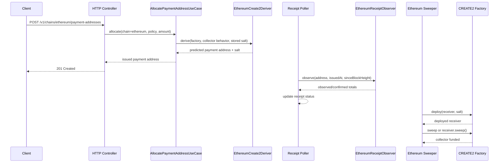

# CREATE2 ETH Payment Receiving - Technical Design

## High-level approach

- Summary:
  - Keep the existing chain-scoped payment-address API and receipt lifecycle.
  - Add a first-class Ethereum issuance path that predicts native ETH payment addresses with
    CREATE2 instead of generating EOAs.
  - Extend the current allocation and receipt-tracking flow with explicit Ethereum adapters for
    CREATE2 prediction, native ETH observation, and funded-address deploy-and-sweep.
  - Clean up issuance naming so Bitcoin HD derivation and Ethereum CREATE2 no longer share
    misleading field names.
- Key decisions:
  - Public chain id should be `ethereum`, not `eth`, to stay consistent with the explicit style of
    `bitcoin`.
  - The first configured Ethereum networks should be `mainnet` and `sepolia`, each with explicit
    CREATE2 policy ids plus per-network collector and derivation-key runtime config rather than one
    implicit shared EVM config.
  - Factory addresses should come from checked-in deployment metadata, and receiver init code
    hashes should be derived from checked-in contract artifacts instead of hand-entered runtime
    env vars.
  - Checked-in deployment metadata may stay public and reviewable. The privacy boundary is that
    public metadata, public API behavior, and public sequential guesses together still must not be
    enough to enumerate future payment addresses.
  - Distinguish the fixed CREATE2 `factory` contract from the rotatable operator signer that pays
    gas to call it. Factory address changes create a new issuance address space; operator-signer
    changes do not.
  - Until T-003 replaces them with deployed values, checked-in deterministic fixture metadata may
    be used to keep local API and Swagger testing paths enabled for configured Ethereum policies.
  - Public default Ethereum RPC endpoints, when provided for local bootstrap convenience, should
    live in deployment config (`compose`, `wrangler`) rather than inside Go loader code so
    operators can override them without changing runtime wiring semantics.
  - Poller deployment should stay scope-specific: one runtime or scheduled job per
    `(chain, network)` pair, even if one binary can construct multiple chain observers.
  - Compose-level poller service names should also stay scope-explicit, for example
    `poller-bitcoin-mainnet`, `poller-bitcoin-testnet4`, `poller-ethereum-mainnet`, and
    `poller-ethereum-sepolia`, so local operations do not mix chain and network identity.
  - The production-like base Compose file should keep mainnet-scoped pollers, while
    `compose.test.yaml` may add test or verification scopes such as Bitcoin `testnet4` and
    Ethereum `sepolia` for local development.
  - Policy `scheme` for this flow should be `create2`.
  - Allocation cursoring may continue to use the existing deterministic sequence model for internal
    reservation and uniqueness, but Ethereum CREATE2 salt must not be derived only from public
    policy metadata plus `derivationIndex`. Each allocation must derive non-public salt material
    from a runtime-managed secret plus stable allocation identity, so operators can reconstruct one
    issued address without relying on a persisted random salt as the only recovery path.
  - Public `GET /v1/chains/{chain}/addresses?addressPolicyId=...&index=...` preview semantics do
    not fit privacy-preserving Ethereum issuance and should remain Bitcoin-only or reject Ethereum
    CREATE2 policies.
  - Do not rely on `SELFDESTRUCT` for fund collection. Use an explicit receiver contract with a
    restricted `sweep()` path or a factory `deployAndSweep(...)` path that forwards only to the
    configured collector.
  - Prefer a caller model where deploy and sweep entry points are either permissionless or governed
    by rotatable operator auth that is not part of the CREATE2 preimage. Safety should come from
    fixed collector routing and restricted call surfaces, not from baking one hot signer into the
    address formula.
  - Replace xpub-biased persistence and config naming with neutral equivalents such as
    `address_source_ref` and `address_reference`.
  - Treat privacy scope honestly: v1 aims to prevent public enumeration of future Ethereum payment
    addresses before settlement, not to provide complete anonymity after funds are swept on-chain.
  - Keep Ethereum technical process state explicit and chain-specific rather than hiding it inside
    a generic untyped blob.

## System context

- Components:
  - Domain:
    - Existing `PaymentAddressAllocation`, `PaymentReceiptTracking`, and payment receipt status
      transitions.
    - Extended issuance configuration that can represent Bitcoin HD and Ethereum CREATE2 without
      fake placeholder fields.
  - Application:
    - Existing `AllocatePaymentAddressUseCase`
    - Existing `GetPaymentAddressStatusUseCase`
    - Existing `RunReceiptPollingCycleUseCase`
    - New `RunEthereumCreate2SweepCycleUseCase` or equivalent internal worker use case
  - Outbound adapters:
    - Existing Bitcoin address deriver and receipt observer
    - New `ethereum` CREATE2 address deriver
    - New `ethereum` native ETH receipt observer
    - New `ethereum` CREATE2 deployment or sweep store plus operator-signer transaction adapter
  - Infrastructure:
    - Ethereum JSON-RPC client
    - Operator-signer integration
    - Thin verification shell wrappers under `scripts/`
    - Go contract tooling under `cmd/` for build, prediction, and explicit chain verification
    - Deployment config under `deployments/compose/` and `deployments/cloudflare/payrune/` with
      separate `mainnet` and `sepolia` collector and derivation-key envs plus checked-in CREATE2
      deployment metadata and receiver artifacts
- Interfaces:
  - Existing public API:
    - `GET /v1/chains/ethereum/address-policies`
    - `POST /v1/chains/ethereum/payment-addresses`
    - `GET /v1/chains/ethereum/payment-addresses/{paymentAddressId}`
  - Internal runtime:
    - Receipt poller cycle for Ethereum rows
    - Dedicated sweeper cycle or equivalent internal settlement trigger
  - Contract-side:
    - CREATE2 factory deployment method
    - Receiver sweep method or factory-assisted deploy-and-sweep method

## Key flows

- Flow 1: allocate one ETH payment address

  - Client calls `POST /v1/chains/ethereum/payment-addresses`.
  - Controller validates the existing request payload and chain path.
  - Allocation use case loads the Ethereum CREATE2 policy, reserves the next deterministic slot,
    derives one allocation-specific non-public salt from runtime-managed secret material, and
    derives a predicted ETH address in-process using the configured factory and init code
    semantics.
  - Allocation persistence stores:
    - public payment address
    - neutral source-reference metadata
    - neutral address-reference metadata that includes the derived CREATE2 salt or equivalent
      deterministic locator
  - Receipt tracking row is created using the existing lifecycle with `chain=ethereum`,
    `network=<configured network>`, `address=<predicted address>`, and ETH amount metadata.
  - Public preview-by-index endpoints do not expose the same issuance path for Ethereum because the
    address is no longer derivable from public index inputs alone.

- Flow 2: observe an ETH payment

  - Poller claims due Ethereum receipt rows.
  - Ethereum observer resolves a bounded scan range from `issued_at`, `since_block_height`, and
    `latest_block_height`.
  - Observer loads blocks or transactions from the configured RPC source and sums native ETH value
    transferred to the tracked payment address.
  - For v1, the observer may scan canonical block transactions with `to == payment address`
    semantics rather than provider-specific execution traces; this keeps the implementation
    portable across standard JSON-RPC providers at the cost of excluding trace-only internal ETH
    transfers from the initial scope.
  - Observer returns `observed_total_minor`, `confirmed_total_minor`,
    `unconfirmed_total_minor`, and `latest_block_height`.
  - Existing receipt-tracking domain logic updates status and drives webhook-outbox behavior.

- Flow 3: deploy and sweep a funded CREATE2 payment address

  - Sweeper selects eligible funded Ethereum payment addresses that are ready for collection.
  - Sweeper uses the configured operator signer to pay gas for collection transactions.
  - Sweeper checks whether receiver code already exists at the predicted address.
  - If not deployed, the sweeper submits the deterministic factory deployment using the stored salt
    and active policy config.
  - After deployment, the sweeper executes the restricted sweep path to forward ETH to the
    configured collector address.
  - Rotating the operator signer does not change predicted addresses because caller identity is not
    part of the CREATE2 derivation inputs.
  - Technical process state is updated with deployment status, tx hashes, and last error so the
    cycle can retry safely.

- Flow 4: startup preflight
  - Bootstrap validates Ethereum addresses, init-code expectations, confirmation settings, fixed
    factory metadata, and operator-signer configuration.
  - Checked-in CREATE2 contract artifacts and deployment metadata should be loaded through a
    dedicated infrastructure asset package instead of living inside the DI wiring package.
  - If configured, the runtime compares Go-side prediction vectors against the active contract
    metadata and fails fast on mismatch before issuing payment addresses.

## Diagrams (optional)

- Mermaid sequence / flow:



## Data model

- Entities:
  - `PaymentAddressAllocation` remains the business record for one issued payment address.
  - `PaymentReceiptTracking` remains the business record for payment observation and lifecycle
    status.
  - No new Ethereum-specific domain aggregate is required for deployment or sweep; that state is a
    technical process record.
- Technical records:
  - Add an explicit Ethereum CREATE2 technical table such as `ethereum_create2_receivers` keyed by
    `payment_address_id` to persist:
    - `payment_address_id`
    - `network`
    - `factory_address`
    - `collector_address`
    - `receiver_address`
    - `salt`
    - `init_code_hash`
    - `deployment_status`
    - `deploy_tx_hash`
    - `sweep_tx_hash`
    - `last_error`
    - timestamps
- Schema changes or migrations:
  - Add a migration that renames or replaces generic allocation columns so the active schema uses
    neutral naming instead of `account_public_key` and `derivation_path`.
  - Add the Ethereum CREATE2 technical process table.
  - Keep existing Bitcoin rows readable and migratable.
- Consistency and idempotency:
  - Allocation uniqueness remains enforced by `(address_policy_id, address_source_ref,
derivation_index)`.
  - For Ethereum, `derivation_index` remains an internal allocation cursor; the actual CREATE2
    address prediction additionally depends on the persisted non-public salt.
  - Public address uniqueness remains enforced by `(chain, address)`.
  - One `payment_address_id` maps to at most one Ethereum CREATE2 technical row.
  - Sweeper claims work items using explicit persisted process state and row-level locking to avoid
    duplicate collection.

## API or contracts

- Endpoints or events:
  - Existing public endpoints remain the primary contract:
    - `GET /v1/chains/ethereum/address-policies`
    - `POST /v1/chains/ethereum/payment-addresses`
    - `GET /v1/chains/ethereum/payment-addresses/{paymentAddressId}`
  - Public preview-by-index endpoint behavior differs by chain:
    - Bitcoin may keep `GET /v1/chains/{chain}/addresses`
    - Ethereum CREATE2 policies should reject or disable this route to avoid making future payment
      addresses enumerable
  - Existing payment receipt status webhook events remain unchanged in shape.
  - Contract caller model should satisfy:
    - caller identity is not part of CREATE2 address derivation
    - caller cannot override the collector destination
    - operator-signer rotation does not require reissuing addresses
  - Internal contract methods should expose at least:
    - address computation semantics that match Go-side prediction
    - deterministic deployment
    - restricted sweep
- Request/response examples:

```http
POST /v1/chains/ethereum/payment-addresses
Content-Type: application/json

{
  "addressPolicyId": "ethereum-mainnet-create2",
  "expectedAmountMinor": 15000000000000000,
  "customerReference": "order-1234"
}
```

```json
{
  "paymentAddressId": "501",
  "addressPolicyId": "ethereum-mainnet-create2",
  "chain": "ethereum",
  "network": "mainnet",
  "scheme": "create2",
  "minorUnit": "wei",
  "decimals": 18,
  "expectedAmountMinor": "15000000000000000",
  "customerReference": "order-1234",
  "address": "0x1234567890abcdef1234567890abcdef12345678"
}
```

## Backward compatibility (optional)

- API compatibility:
  - Existing payment-address request and status response shapes remain unchanged.
  - Existing Bitcoin endpoints remain unchanged.
- Data migration compatibility:
  - Existing Bitcoin rows and current payment status lookups must remain readable after the
    allocation-column cleanup.
  - No Ethereum backfill is required before rollout because Ethereum payment addresses do not exist
    yet.

## Failure modes and resiliency

- Retries/timeouts:
  - Receipt observation and sweeper execution must be retriable without duplicate side effects.
  - JSON-RPC timeouts or transient deploy failures should update row-level error state and retry
    later.
- Backpressure/limits:
  - Ethereum observation must use bounded block ranges and chunking rather than unbounded full-chain
    scans.
  - Sweeper concurrency must be limited so signer nonce management and RPC throughput stay stable.
- Degradation strategy:
  - If Ethereum config is disabled or invalid, Ethereum policies remain non-issuable while Bitcoin
    behavior stays available.
  - If sweeping fails, the payment may still remain marked as paid while collection retries
    continue through explicit technical process state.
  - If Go-side prediction cannot be trusted for the active contract metadata, Ethereum issuance
    should fail closed rather than issuing unverifiable addresses.
  - If privacy-preserving salt generation or persistence is unavailable, Ethereum issuance should
    fail closed rather than falling back to a publicly enumerable index-based derivation path.

## Observability

- Logs:
  - Allocation logs for Ethereum should include `paymentAddressId`, `addressPolicyId`, `chain`,
    `network`, and `address`, but should avoid raw salt or full source-ref material outside
    explicit debug-only workflows.
  - Receipt polling logs should include chain, network, address, scan range, and totals.
  - Sweeper logs should include payment address id, receiver address, deploy tx hash, sweep tx
    hash, and error reason.
- Metrics:
  - Count issued Ethereum addresses, payment observation successes and failures, deploy attempts,
    deploy failures, sweep attempts, and sweep failures.
- Traces:
  - Keep public API request traces separate from poller and sweeper internal traces or cycle logs.
- Alerts:
  - Alert on repeated prediction mismatch, repeated deploy failure, repeated sweep failure, or ETH
    receipts older than the expected collection window.

## Security

- Authentication/authorization:
  - No public auth changes are required for customer-facing issuance or status APIs in this scope.
  - Internal deploy or sweep orchestration remains operator-controlled runtime behavior even if the
    on-chain factory or receiver entry points are caller-agnostic.
- Secrets:
  - Operator-signer credentials are runtime secrets only and must not be persisted in the database.
  - Allocation-specific CREATE2 salt material is internal-only operational data and must not be
    exposed through customer-facing APIs, webhooks, or default logs.
- Abuse cases:
  - Anyone can send dust ETH to a predicted address; the system must tolerate unexpected inbound
    value.
  - A misconfigured collector address would route funds incorrectly, so startup validation and
    operator review are mandatory.
  - The receiver contract must not expose arbitrary target selection for sweeps.
  - A public preview or index-derived issuance path would leak future payment-address space and is
    therefore not acceptable for Ethereum privacy mode.

## Alternatives considered

- Option A:
  - Generate one EOA private key per payment address.
- Option B:
  - Use an HD-wallet-like Ethereum derivation scheme and keep sweeping from EOAs.
- Option C:
  - Use CREATE2-predicted payable receiver addresses with post-funding deployment and sweep.
- Why chosen:
  - Option C preserves one-address-per-payment semantics without per-payment private-key custody and
    fits the current deterministic-address issuance model better than EOA management.

## Risks

- Risk:
  - Current issuance and persistence naming is still Bitcoin-biased, so a naive implementation can
    easily hide Ethereum behavior behind misleading field semantics.
  - Mitigation:
    - Clean up naming first and keep Ethereum technical records explicit.
- Risk:
  - A publicly enumerable salt rule or public preview endpoint would let third parties derive
    future payment addresses for one Ethereum policy.
  - Mitigation:
    - Persist non-public allocation salts, keep preview-by-index disabled for Ethereum, and avoid
      exposing raw source-ref material in public surfaces.
- Risk:
  - Native ETH observation is harder than token log scanning because plain ETH transfers are not
    emitted as ERC-20 logs.
  - Mitigation:
    - Use block or transaction scanning with bounded ranges and contract tests against an explicit
      verification network.
- Risk:
  - A contract or prediction mismatch could strand funds at an address the runtime cannot deploy or
    sweep correctly.
  - Mitigation:
    - Add preflight checks, vector tests, local deployment smoke tests, and fail-closed startup
      validation.
