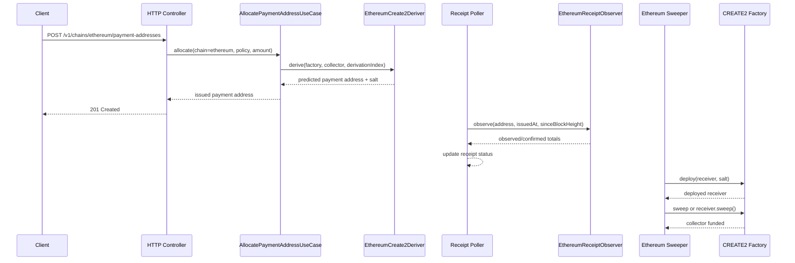

# CREATE2 ETH Payment Receiving - Technical Design

## High-level approach

- Summary:
  - Keep the existing chain-scoped payment-address API and receipt lifecycle.
  - Add a first-class Ethereum issuance path that predicts native ETH payment addresses with
    CREATE2 instead of generating EOAs.
  - Extend the current allocation and receipt-tracking flow with explicit Ethereum adapters for
    CREATE2 prediction, native ETH observation, and funded-address deploy-and-sweep.
  - Clean up issuance naming so Bitcoin HD derivation and Ethereum CREATE2 no longer share
    misleading field names.
- Key decisions:
  - Public chain id should be `ethereum`, not `eth`, to stay consistent with the explicit style of
    `bitcoin`.
  - Policy `scheme` for this flow should be `create2`.
  - Address slot allocation should continue to use the existing deterministic sequence model.
    CREATE2 salt is derived from server-side allocation state such as `addressPolicyId` plus
    `derivationIndex`, not from a database row id discovered after the fact.
  - Do not rely on `SELFDESTRUCT` for fund collection. Use an explicit receiver contract with a
    restricted `sweep()` path or a factory `deployAndSweep(...)` path that forwards only to the
    configured collector.
  - Replace xpub-biased persistence and config naming with neutral equivalents such as
    `address_source_ref` and `address_reference`.
  - Keep Ethereum technical process state explicit and chain-specific rather than hiding it inside
    a generic untyped blob.

## System context

- Components:
  - Domain:
    - Existing `PaymentAddressAllocation`, `PaymentReceiptTracking`, and payment receipt status
      transitions.
    - Extended issuance configuration that can represent Bitcoin HD and Ethereum CREATE2 without
      fake placeholder fields.
  - Application:
    - Existing `AllocatePaymentAddressUseCase`
    - Existing `GetPaymentAddressStatusUseCase`
    - Existing `RunReceiptPollingCycleUseCase`
    - New `RunEthereumCreate2SweepCycleUseCase` or equivalent internal worker use case
  - Outbound adapters:
    - Existing Bitcoin address deriver and receipt observer
    - New `ethereum` CREATE2 address deriver
    - New `ethereum` native ETH receipt observer
    - New `ethereum` CREATE2 deployment or sweep store plus signer or deployer adapter
  - Infrastructure:
    - Ethereum JSON-RPC client
    - Signer or deployer integration
    - Local dev chain and contract deployment scripts under `scripts/`
- Interfaces:
  - Existing public API:
    - `GET /v1/chains/ethereum/address-policies`
    - `POST /v1/chains/ethereum/payment-addresses`
    - `GET /v1/chains/ethereum/payment-addresses/{paymentAddressId}`
  - Internal runtime:
    - Receipt poller cycle for Ethereum rows
    - Dedicated sweeper cycle or equivalent internal settlement trigger
  - Contract-side:
    - CREATE2 factory deployment method
    - Receiver sweep method or factory-assisted deploy-and-sweep method

## Key flows

- Flow 1: allocate one ETH payment address

  - Client calls `POST /v1/chains/ethereum/payment-addresses`.
  - Controller validates the existing request payload and chain path.
  - Allocation use case loads the Ethereum CREATE2 policy, reserves the next deterministic slot,
    and derives a predicted ETH address in-process using the configured factory and init code
    semantics.
  - Allocation persistence stores:
    - public payment address
    - neutral source-reference metadata
    - neutral address-reference metadata that includes the CREATE2 salt or equivalent deterministic
      locator
  - Receipt tracking row is created using the existing lifecycle with `chain=ethereum`,
    `network=<configured network>`, `address=<predicted address>`, and ETH amount metadata.

- Flow 2: observe an ETH payment

  - Poller claims due Ethereum receipt rows.
  - Ethereum observer resolves a bounded scan range from `issued_at`, `since_block_height`, and
    `latest_block_height`.
  - Observer loads blocks or transactions from the configured RPC source and sums native ETH value
    transferred to the tracked payment address.
  - Observer returns `observed_total_minor`, `confirmed_total_minor`,
    `unconfirmed_total_minor`, and `latest_block_height`.
  - Existing receipt-tracking domain logic updates status and drives webhook-outbox behavior.

- Flow 3: deploy and sweep a funded CREATE2 payment address

  - Sweeper selects eligible funded Ethereum payment addresses that are ready for collection.
  - Sweeper checks whether receiver code already exists at the predicted address.
  - If not deployed, the sweeper submits the deterministic factory deployment using the stored salt
    and active policy config.
  - After deployment, the sweeper executes the restricted sweep path to forward ETH to the
    configured collector address.
  - Technical process state is updated with deployment status, tx hashes, and last error so the
    cycle can retry safely.

- Flow 4: startup preflight
  - Bootstrap validates Ethereum addresses, init-code expectations, confirmation settings, and
    signer configuration.
  - If configured, the runtime compares Go-side prediction vectors against the active contract
    metadata and fails fast on mismatch before issuing payment addresses.

## Diagrams (optional)

- Mermaid sequence / flow:



## Data model

- Entities:
  - `PaymentAddressAllocation` remains the business record for one issued payment address.
  - `PaymentReceiptTracking` remains the business record for payment observation and lifecycle
    status.
  - No new Ethereum-specific domain aggregate is required for deployment or sweep; that state is a
    technical process record.
- Technical records:
  - Add an explicit Ethereum CREATE2 technical table such as `ethereum_create2_receivers` keyed by
    `payment_address_id` to persist:
    - `payment_address_id`
    - `network`
    - `factory_address`
    - `collector_address`
    - `receiver_address`
    - `salt`
    - `init_code_hash`
    - `deployment_status`
    - `deploy_tx_hash`
    - `sweep_tx_hash`
    - `last_error`
    - timestamps
- Schema changes or migrations:
  - Add a migration that renames or replaces generic allocation columns so the active schema uses
    neutral naming instead of `account_public_key` and `derivation_path`.
  - Add the Ethereum CREATE2 technical process table.
  - Keep existing Bitcoin rows readable and migratable.
- Consistency and idempotency:
  - Allocation uniqueness remains enforced by `(address_policy_id, address_source_ref,
derivation_index)`.
  - Public address uniqueness remains enforced by `(chain, address)`.
  - One `payment_address_id` maps to at most one Ethereum CREATE2 technical row.
  - Sweeper claims work items using explicit persisted process state and row-level locking to avoid
    duplicate collection.

## API or contracts

- Endpoints or events:
  - Existing public endpoints remain the primary contract:
    - `GET /v1/chains/ethereum/address-policies`
    - `POST /v1/chains/ethereum/payment-addresses`
    - `GET /v1/chains/ethereum/payment-addresses/{paymentAddressId}`
  - Existing payment receipt status webhook events remain unchanged in shape.
  - Internal contract methods should expose at least:
    - address computation semantics that match Go-side prediction
    - deterministic deployment
    - restricted sweep
- Request/response examples:

```http
POST /v1/chains/ethereum/payment-addresses
Content-Type: application/json

{
  "addressPolicyId": "ethereum-mainnet-create2",
  "expectedAmountMinor": 15000000000000000,
  "customerReference": "order-1234"
}
```

```json
{
  "paymentAddressId": "501",
  "addressPolicyId": "ethereum-mainnet-create2",
  "chain": "ethereum",
  "network": "mainnet",
  "scheme": "create2",
  "minorUnit": "wei",
  "decimals": 18,
  "expectedAmountMinor": "15000000000000000",
  "customerReference": "order-1234",
  "address": "0x1234567890abcdef1234567890abcdef12345678"
}
```

## Backward compatibility (optional)

- API compatibility:
  - Existing payment-address request and status response shapes remain unchanged.
  - Existing Bitcoin endpoints remain unchanged.
- Data migration compatibility:
  - Existing Bitcoin rows and current payment status lookups must remain readable after the
    allocation-column cleanup.
  - No Ethereum backfill is required before rollout because Ethereum payment addresses do not exist
    yet.

## Failure modes and resiliency

- Retries/timeouts:
  - Receipt observation and sweeper execution must be retriable without duplicate side effects.
  - JSON-RPC timeouts or transient deploy failures should update row-level error state and retry
    later.
- Backpressure/limits:
  - Ethereum observation must use bounded block ranges and chunking rather than unbounded full-chain
    scans.
  - Sweeper concurrency must be limited so signer nonce management and RPC throughput stay stable.
- Degradation strategy:
  - If Ethereum config is disabled or invalid, Ethereum policies remain non-issuable while Bitcoin
    behavior stays available.
  - If sweeping fails, the payment may still remain marked as paid while collection retries
    continue through explicit technical process state.
  - If Go-side prediction cannot be trusted for the active contract metadata, Ethereum issuance
    should fail closed rather than issuing unverifiable addresses.

## Observability

- Logs:
  - Allocation logs for Ethereum should include `paymentAddressId`, `addressPolicyId`, `chain`,
    `network`, `address`, and salt or reference identifier.
  - Receipt polling logs should include chain, network, address, scan range, and totals.
  - Sweeper logs should include payment address id, receiver address, deploy tx hash, sweep tx
    hash, and error reason.
- Metrics:
  - Count issued Ethereum addresses, payment observation successes and failures, deploy attempts,
    deploy failures, sweep attempts, and sweep failures.
- Traces:
  - Keep public API request traces separate from poller and sweeper internal traces or cycle logs.
- Alerts:
  - Alert on repeated prediction mismatch, repeated deploy failure, repeated sweep failure, or ETH
    receipts older than the expected collection window.

## Security

- Authentication/authorization:
  - No public auth changes are required for customer-facing issuance or status APIs in this scope.
  - Internal deploy or sweep actions must be operator-only runtime behavior.
- Secrets:
  - Signer or deployer credentials are runtime secrets only and must not be persisted in the
    database.
- Abuse cases:
  - Anyone can send dust ETH to a predicted address; the system must tolerate unexpected inbound
    value.
  - A misconfigured collector address would route funds incorrectly, so startup validation and
    operator review are mandatory.
  - The receiver contract must not expose arbitrary target selection for sweeps.

## Alternatives considered

- Option A:
  - Generate one EOA private key per payment address.
- Option B:
  - Use an HD-wallet-like Ethereum derivation scheme and keep sweeping from EOAs.
- Option C:
  - Use CREATE2-predicted payable receiver addresses with post-funding deployment and sweep.
- Why chosen:
  - Option C preserves one-address-per-payment semantics without per-payment private-key custody and
    fits the current deterministic-address issuance model better than EOA management.

## Risks

- Risk:
  - Current issuance and persistence naming is still Bitcoin-biased, so a naive implementation can
    easily hide Ethereum behavior behind misleading field semantics.
  - Mitigation:
    - Clean up naming first and keep Ethereum technical records explicit.
- Risk:
  - Native ETH observation is harder than token log scanning because plain ETH transfers are not
    emitted as ERC-20 logs.
  - Mitigation:
    - Use block or transaction scanning with bounded ranges and contract tests on local dev chains.
- Risk:
  - A contract or prediction mismatch could strand funds at an address the runtime cannot deploy or
    sweep correctly.
  - Mitigation:
    - Add preflight checks, vector tests, local deployment smoke tests, and fail-closed startup
      validation.
