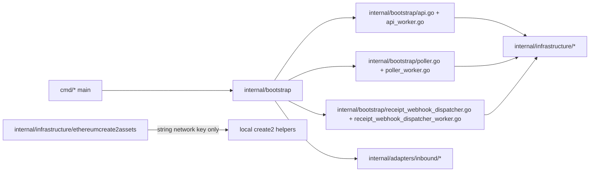

# Technical Design

## High-level approach

- Summary: 以「搬動責任，不改變行為」為原則，先把明顯放錯層的程式碼移回 `internal/` 內適當責任邊界，接著把 composition root 從 infrastructure 移到 bootstrap，再把 infrastructure 內殘留的 adapter/domain/env 耦合全部拔掉，最後把多餘的 `bootstrap/di` 子樹收回 `internal/bootstrap`。本輪再補一刀，把 bootstrap 對 adapter 專屬 address policy config 的依賴改成 domain-native catalog，並把 bootstrap test-locality worklog 合回同一份 architecture spec。
- Key decisions:
  - 將 fake webhook HTTP handler 置於 inbound HTTP adapter，程序啟動與 TLS/環境設定置於 bootstrap。
  - 將 poller 與 webhook dispatcher 的 env parsing 置於 bootstrap，讓 `cmd/` 只剩 signal handling 與 bootstrap 呼叫。
  - 將 Cloudflare worker operation dispatch 置於 bootstrap，避免 `cmd/payrune-worker` 承擔 runtime routing。
  - 對 `ethereumcreate2assets` 直接加入局部 create2 helper，避免 infrastructure 反向依賴 adapter。
  - 將原本 `internal/infrastructure/di` 的 composition root 搬到 bootstrap，讓 `internal/infrastructure` 只保留 runtime bridge / external integration / assets。
  - 同步更新 `AGENTS.md`，把 wiring 與 infrastructure 的責任文字契約對齊程式碼現況。
  - 將 bootstrap runtime wiring 依 `api`、`poller`、`webhookdispatcher` 責任拆成具體檔案群，讓 process-hosted runtime 與 worker runtime builder 依責任就近放置。
  - 將 Cloudflare JS bridge contract 與 query/webhook 技術錯誤型別收斂回各自的 infrastructure package，讓 adapter 改為依賴技術邊界 contract。
  - 新增 process-hosted DB wiring helper，讓 `DATABASE_URL` env parsing 從 driver 回到 bootstrap。
  - 將 `ethereumcreate2assets` 的 network lookup key 由 domain value object 改成純 string key，避免 infrastructure 對 domain 建立語意依賴。
  - 移除 `internal/infrastructure/drivers` 這層 generic naming，改成直接以 `internal/infrastructure/cloudflarepostgres`、`internal/infrastructure/cloudflarewebhook`、`internal/infrastructure/postgres` 命名。
  - 將 `internal/bootstrap/di` 收回 `internal/bootstrap`，讓 runtime wiring 直接與各自 bootstrap owner 靠在一起。
  - 移除 bootstrap runtime/container/helper 中沒有辨識價值的 `process` 前綴，保留 `worker` 與 `env` 這類真正表意的命名。
  - 將 API / poller / webhook dispatcher 的 run/config/runtime source files 再往 owning bootstrap 合併，減少小檔案切分；不保留獨立的 `postgres_env.go`。
  - 將 outbound policy adapter 的輸入從 adapter-local `AddressPolicyConfig` 改成 domain-native `entities.AddressIssuancePolicy`，讓 bootstrap 只組 deployment catalog，不理解 adapter 私有輸入 shape。

## System context

- Components:
  - `cmd/*`: 進程進入點。
  - `internal/bootstrap`: runtime config、process startup、worker request dispatch。
  - `internal/bootstrap/api.go`: API server startup、runtime wiring 與 shared postgres env helper。
  - `internal/bootstrap/api_worker.go`: API worker envelope 與 Cloudflare runtime wiring。
  - `internal/bootstrap/poller.go`: poller config、run loop 與 runtime wiring。
  - `internal/bootstrap/poller_worker.go`: poller worker envelope 與 Cloudflare runtime wiring。
  - `internal/bootstrap/receipt_webhook_dispatcher.go`: dispatcher config、run loop 與 runtime wiring。
  - `internal/bootstrap/receipt_webhook_dispatcher_worker.go`: dispatcher worker envelope 與 Cloudflare runtime wiring。
  - `internal/adapters/inbound/http/fakewebhook`: fake webhook transport handler。
  - `internal/infrastructure/*`: runtime bridges、external-service integrations、embedded metadata 與純技術 helper。
  - `internal/adapters/outbound/policy`: 將 domain-native address issuance policy catalog 實作成 outbound `AddressPolicyReader`。
- Interfaces:
  - `bootstrap.Load*ConfigFromEnv()` 提供 runtime config 組裝。
  - `fakewebhook.NewHandler(logger, secret)` 提供 HTTP handler。
  - `bootstrap.DispatchCloudflareWorkerOperationJSON(ctx, operation, payload)` 封裝 worker operation routing。
  - `bootstrap` package 內的 runtime-specific files 提供 concrete wiring。

## Key flows

- Flow 1: `cmd/poller`/`cmd/webhook-dispatcher` 啟動時建立 signal context -> 呼叫 `bootstrap.Load*ConfigFromEnv()` -> 將結果交給 `bootstrap.Run*()`。
- Flow 2: `cmd/fake-webhook-receiver` 啟動時呼叫 bootstrap 載入 config、建立 TLS cert、注入 `fakewebhook.NewHandler()` 到 `http.Server`。
- Flow 3: `cmd/payrune-worker` 只負責 JS glue，operation 字串解析與對應 bootstrap handler 的 switch 移到 bootstrap。
- Flow 4: `bootstrap/*` runtime 直接在同 package 內組裝 adapters/usecases/runtime bridge，不再從 `internal/infrastructure` 取用 composition root。
- Flow 5: `ethereumcreate2assets` 讀取 embedded metadata 後，在 package 內完成 init code / hash / source-ref 計算，不向 adapter 層借 helper。
- Flow 6: `bootstrap` 層依 runtime 類型選用對應的 runtime-specific files，而不是依賴一個混合式 DI package。
- Flow 7: bootstrap owning files 直接讀取 `DATABASE_URL` 並開啟 DB，再交給各自的 API/poller/webhook dispatcher runtime builder；不再保留獨立的 postgres env helper 檔。
- Flow 8: outbound adapter 以 infrastructure technical contract 組裝 Cloudflare runtime bridge，而不是讓 infrastructure package 反向 import adapter contract。
- Flow 9: infrastructure 路徑直接以具體技術名稱命名，讓 import path 本身就表達責任，而不是再包一層 `drivers/`。
- Flow 10: bootstrap entrypoint 與 runtime wiring 位於同一 package，下層只保留少量 runtime-specific 檔案分工，不再跳到 `bootstrap/di/*`。
- Flow 11: bootstrap 根據 env 與 create2 runtime 能力組出 `[]entities.AddressIssuancePolicy` catalog，再交給 outbound policy adapter；adapter 只負責提供 read-model behavior，不再要求 bootstrap 構造 adapter-local config struct。

## Diagrams (optional)

- Mermaid sequence / flow:

## Data model

- Entities: 無新增 domain entity 或 persistence model。
- Schema changes or migrations: 無。
- Consistency and idempotency: 僅搬移 code location，不改變 handler/request payload 或 DB 邏輯。

## API or contracts

- Endpoints or events:
  - fake webhook receiver 仍接受原本的 `X-Payrune-*` headers 與 JSON body。
  - Cloudflare worker JS 仍透過相同 operation 名稱呼叫 bootstrap handler。
- Request/response examples:
  - 無 contract 變更；測試用現有 payload/headers 驗證。

## Backward compatibility (optional)

- API compatibility: 外部 HTTP 與 worker payload contract 不變；僅 repo 內部 package import path 調整。
- Data migration compatibility: 不涉及資料搬遷。

## Failure modes and resiliency

- Retries/timeouts: poller/dispatcher 預設值與 fake webhook TLS 啟動行為維持既有設定。
- Backpressure/limits: 不新增背景 goroutine 或 queue。
- Degradation strategy: 若 env 無效仍回傳既有錯誤；若 fake webhook body/簽章無效仍回相同失敗狀態碼。

## Observability

- Logs: 保留 fake webhook request/signature log 與 poller/dispatcher cycle log。
- Metrics: 無新增 metrics。
- Traces: 無。
- Alerts: 無。

## Security

- Authentication/authorization: 不適用。
- Secrets: fake webhook secret 與 create2 derivation input 驗證行為不變。
- Abuse cases: invalid JSON、invalid HMAC、錯誤 env 值、錯誤 hex input 需持續被拒絕。

## Alternatives considered

- Option A: 保留 infrastructure 反向 import adapter/domain，接受少量技術耦合。
- Option B: 把 bridge contract 留在 adapter，僅用文件規範 infrastructure 不要有商業邏輯。
- Option C: 將 technical contract、process env ownership、asset key 一次收斂回正確邊界。
- Why chosen: 使用者明確要求「完全移出去」與「完美實踐」；因此這輪不再接受技術性反向依賴殘留，而是把 contract 和 env ownership 一起收乾淨。

## Risks

- Risk: 搬移檔案後測試路徑與 package 名稱調整可能造成小範圍編譯錯誤。
- Mitigation: 保留或搬移現有測試並以 targeted `go test` 驗證。
- Risk: AGENTS 或當日 spec 若不跟著更新，後續 agent 可能把 DI 再放回 infrastructure。
- Mitigation: 合併當日 spec，並同步修正 `AGENTS.md` 的目錄責任契約。
- Risk: 過度抽出 generic shared wiring helper，反而又回到抽象過重。
- Mitigation: 優先建立 `api` / `poller` / `webhookdispatcher` 具體 package，只在有明確重用點時才保留小型共用 helper。
- Risk: 移動 bridge contract 後，adapter 測試 double 與 worker wiring 可能同時需要修正。
- Mitigation: 以 type signature 為中心一次修改所有 call site，並用 targeted `go test` 覆蓋 adapter/infrastructure/bootstrap。
- Risk: `cmd/ethereum-create2-tool` 仍留有後續工作。
- Mitigation: 在 spec 中明確標記為本輪 out of scope，不用半套抽象混入本次 patch。
- Risk: API process runtime 與 API worker runtime 的 address policy catalog 若各自手寫，可能再次分岔。
- Mitigation: 將 catalog builder 留在 bootstrap 共用 helper，兩側 runtime 一起使用並以測試鎖住。
