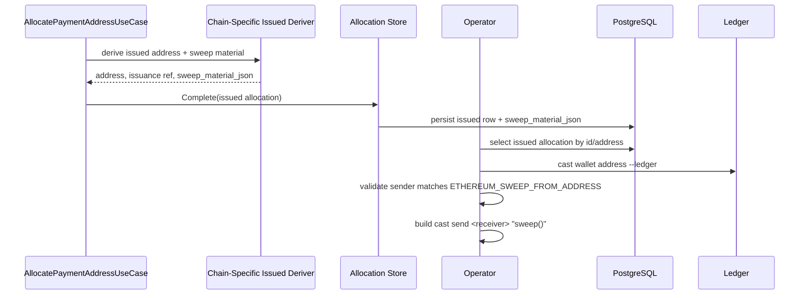

# Allocation Recovery Schema Phase 1 - Technical Design

## High-level approach

- Summary:
  - Preserve the current internal allocation / cursor schema and add one operator-facing
    `sweep_material_json` on `address_policy_allocations`.
  - Populate that JSON at issuance time inside the chain-specific issued-address derivers, because
    those adapters already own the chain-specific recovery details.
  - Backfill existing issued rows in SQL from current persisted data, without modifying
    `address_space_ref`, `slot_index`, `issuance_ref`, or cursor rows.
  - Add a DB-driven ETH sweep shell helper that selects one issued row, reads
    `sweep_material_json`, validates env and Ledger sender identity, and assembles or broadcasts
    `cast send <receiver> "sweep()"`.
- Key decisions:
  - Use Full mode because this phase adds schema changes, a backfill migration, and a new
    operator workflow with failure-mode handling.
  - Keep `issuance_ref` / `issuance_ref_kind` as internal compatibility fields for phase 1.
  - Do not rename or remove `address_space_ref`, do not change cursor partitioning, and do not
    tighten allocation continuity constraints in this phase.
  - Use `sweep_material_json` as the only operator-facing recovery payload; do not introduce a
    second JSON such as `issuance_space_json`.
  - Prefer application / adapter enforcement plus focused tests over a new strict DB check
    constraint in phase 1, to avoid rollout risk against the old allocation binary.

## System context

- Components:
  - Domain:
    - `PaymentAddressAllocation` gains `sweep_material_json` as issued-state metadata.
  - Application:
    - `AllocatePaymentAddressUseCase` continues to orchestrate reservation, derivation, completion,
      and receipt tracking in one transaction.
  - Outbound adapters:
    - Bitcoin issued-address deriver builds BTC sweep material JSON from xpub, scheme, and absolute
      HD path.
    - Ethereum issued-address deriver builds CREATE2 sweep material JSON from address-space ref,
      derived salt, and embedded receiver artifact metadata.
    - Postgres and Cloudflare Postgres allocation stores read/write the new column.
  - Operator tooling:
    - New shell helper under `scripts/` uses `psql`, `jq`, and `cast`.
- Interfaces:
  - Existing public allocation APIs remain unchanged.
  - New operator helper interface is env + CLI-flag driven and queries the DB directly.

## Key flows

- Flow 1:
  - New Bitcoin issuance writes sweep material.
  - `AllocatePaymentAddressUseCase` reserves a slot as today.
  - Bitcoin issued-address deriver derives address + absolute HD path and additionally marshals one
    BTC sweep material JSON payload containing chain, network, xpub, path, address, and script
    type.
  - `allocationStore.Complete(...)` persists `sweep_material_json` along with the existing issued
    fields.
- Flow 2:
  - New Ethereum CREATE2 issuance writes sweep material.
  - Ethereum issued-address deriver derives the CREATE2 salt and predicted address as today.
  - The same adapter parses `address_space_ref` to recover factory / collector / init-code-hash,
    resolves the embedded receiver artifact for the configured network, reconstructs `init_code_hex`,
    and marshals the CREATE2 sweep material JSON.
  - The store persists the JSON with the issued row; receipt tracking stays unchanged.
- Flow 3:
  - Existing issued-row backfill.
  - Migration `000013` adds the nullable JSON column only.
  - Migration `000014` backfills `sweep_material_json` for existing `allocation_status='issued'`
    rows.
  - BTC rows use persisted `chain`, `network`, `address`, `issuance_ref`, `address_space_ref`, and
    `scheme`.
  - ETH rows parse `factory`, `collector`, and `init_code_hash` from `address_space_ref`, use
    `issuance_ref` as `create2_salt`, use `address` as both `address` and `predicted_address`, and
    reconstruct `init_code_hex` from the checked-in receiver creation code plus collector address.
- Flow 4:
  - ETH sweep helper dry-run / broadcast.
  - Script validates required env: `DATABASE_URL`, one selector env, `ETHEREUM_SWEEP_RPC_URL`,
    `ETHEREUM_SWEEP_FROM_ADDRESS`, and optional `ETHEREUM_SWEEP_DERIVATION_PATH`.
  - Script loads exactly one issued allocation row from the DB and reads `sweep_material_json`.
  - Script rejects rows whose JSON is missing, malformed, non-Ethereum, or not CREATE2 sweep
    material.
  - Script queries the Ledger sender address via `cast wallet address --ledger` and optional
    derivation path, compares it to `ETHEREUM_SWEEP_FROM_ADDRESS`, and aborts on mismatch.
  - Dry-run prints the resolved DB row summary and the `cast send ... "sweep()"` command.
  - Broadcast executes that command only when explicitly requested.

## Diagrams (optional)

- Mermaid sequence / flow:



## Data model

- Entities:
  - `PaymentAddressAllocation` gains `SweepMaterialJSON string`.
- Schema changes or migrations:
  - `000013_add_sweep_material_json` adds nullable `sweep_material_json`.
  - `000014_backfill_sweep_material_json` populates existing issued rows.
- Consistency and idempotency:
  - Reservation, reopening, and cursor sequencing remain unchanged.
  - Reopened / derivation-failed rows clear `sweep_material_json` together with the rest of issued
    metadata so stale operator material cannot survive a retry.
  - Backfill updates only already-issued rows and does not rewrite slot numbering or cursor state.

## API or contracts

- Endpoints or events:
  - No public API or webhook shape changes in phase 1.
- Request/response examples:
  - BTC sweep material shape:

```json
{
  "material_type": "bitcoin_hd",
  "material_version": 1,
  "chain": "bitcoin",
  "network": "mainnet",
  "address": "bc1qexample",
  "hd_derivation_path": "m/84'/0'/0'/0/11",
  "account_xpub": "xpub6CUGRU...",
  "script_type": "nativeSegwit"
}
```

- ETH CREATE2 sweep material shape:

```json
{
  "material_type": "ethereum_create2",
  "material_version": 1,
  "chain": "ethereum",
  "network": "mainnet",
  "address": "0x1234...",
  "predicted_address": "0x1234...",
  "factory_address": "0x1111...",
  "collector_address": "0x2222...",
  "create2_salt": "0xaaaa...",
  "init_code_hex": "0x60a0...",
  "init_code_hash": "0xbbbb..."
}
```

## Backward compatibility (optional)

- API compatibility:
  - `POST /v1/chains/bitcoin/payment-addresses` and
    `POST /v1/chains/ethereum/payment-addresses` stay unchanged.
- Data migration compatibility:
  - Existing `issuance_ref`, `issuance_ref_kind`, `address_space_ref`, and `slot_index` stay
    readable and keep their current semantics.
  - Existing issued rows gain `sweep_material_json` in place; non-issued rows are unchanged.

## Failure modes and resiliency

- Retries/timeouts:
  - If sweep-material construction fails during issuance, the issued-address deriver returns an
    error and the allocation follows the existing derivation-failed path instead of persisting a
    half-issued row.
- Backpressure/limits:
  - Not changed in phase 1.
- Degradation strategy:
  - The ETH sweep helper exits early on env / selector / JSON / Ledger mismatch rather than falling
    back to internal-field inference.

## Observability

- Logs:
  - The shell helper prints selected row identifiers, resolved network/address, and whether it is
    running in dry-run or broadcast mode.
- Metrics:
  - No new service metric is required in phase 1.
- Traces:
  - Not changed.
- Alerts:
  - Not changed.

## Security

- Authentication/authorization:
  - No API auth changes.
- Secrets:
  - `DATABASE_URL` and `ETHEREUM_SWEEP_RPC_URL` remain operator-provided envs.
  - The helper does not take factory / collector / salt secrets from env.
- Abuse cases:
  - A mismatched Ledger sender must stop the script before broadcast.
  - A row with missing or malformed `sweep_material_json` must be rejected instead of inferred from
    compatibility fields.

## Alternatives considered

- Option A:
  - Refactor `address_space_ref`, cursor partitioning, and operator recovery together.
- Option B:
  - Keep scripts reading `issuance_ref` / `address_space_ref` directly and skip the JSON column.
- Why chosen:
  - Phase-1 safety requires operator recoverability now without risking allocation continuity.
  - A single JSON payload reduces operator confusion and gives phase 2 a stable handoff boundary.

## Risks

- Risk:
  - ETH backfill duplicates fixed receiver-artifact knowledge in SQL.
- Mitigation:
  - Limit that duplication to phase-1 backfill only; document broader normalization as a phase-2
    follow-up.
- Risk:
  - Without a strict DB check constraint, a future code regression could write null sweep material.
- Mitigation:
  - Enforce non-empty sweep material in the issuance write path and cover both chains with focused
    tests; tighten DB constraints only in a later low-risk phase if needed.
- Risk:
  - Scope creep into cursor or compatibility-field cleanup.
- Mitigation:
  - Explicitly defer any allocation / cursor / space-key redesign to phase 2 in the task plan.
