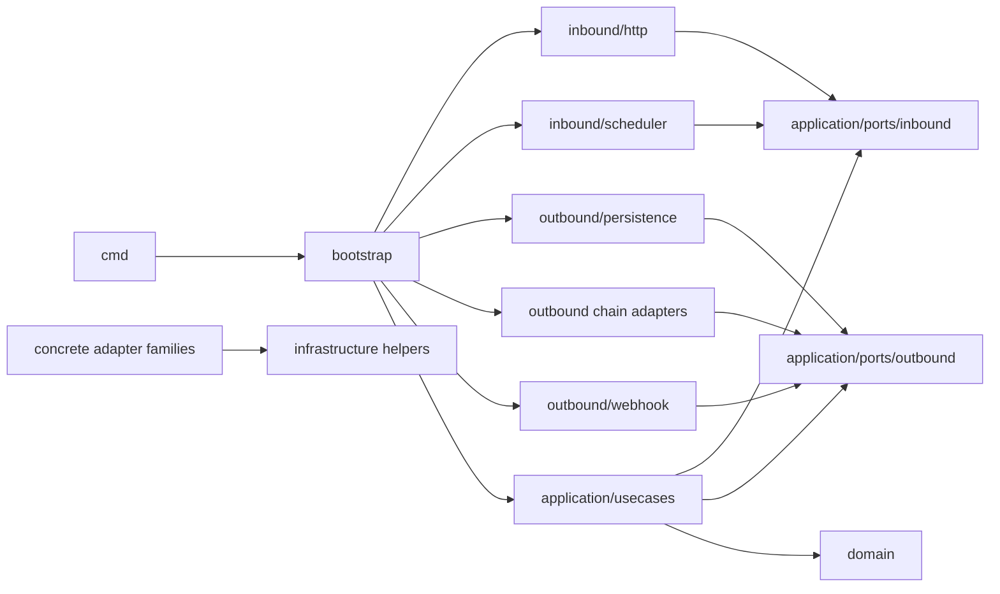

# Technical Design

## High-level approach

- Summary: Install/configure keepline, move adapter-facing contracts under
  `internal/application/ports/**`, update adapters/use cases/bootstrap to use those contracts, and
  encode final architecture boundaries in `keepline.toml`.
- Key decisions:
  - Keep domain runtime code independent from application and implementation layers.
  - Keep application use cases as orchestration code under `internal/application/usecases`.
  - Keep application port contracts under `internal/application/ports/inbound` and
    `internal/application/ports/outbound`.
  - Allow adapters to import application port packages and infrastructure helpers only.
  - Keep bootstrap and `cmd` as composition roots.
  - Enforce import policy in pre-commit through `keepline import-check`.

## System context

- Components:
  - `cmd/**`: process entrypoints.
  - `internal/bootstrap/**`: dependency wiring, env parsing, concrete construction, and process
    composition.
  - `internal/application/ports/inbound`: inbound use-case interfaces, commands, responses, and
    shared inbound contract errors.
  - `internal/application/ports/outbound`: outbound dependency interfaces, records, inputs,
    results, and shared outbound contract errors.
  - `internal/application/usecases`: transaction boundaries, workflow orchestration, domain mapping,
    and use-case behavior.
  - `internal/domain/**`: business model, invariants, entities, events, value objects, and policies.
  - `internal/adapters/inbound/**`: HTTP and scheduler adapters.
  - `internal/adapters/outbound/**`: persistence, policy-reader, blockchain, chain-specific,
    webhook, and system adapters.
  - `internal/infrastructure/**`: low-level technical helpers and runtime bridges.
- Interfaces:
  - Inbound adapters depend on `internal/application/ports/inbound`.
  - Outbound adapters depend on `internal/application/ports/outbound`.
  - Use cases depend on inbound/outbound ports and domain.
  - Bootstrap wires concrete adapters to use cases and infrastructure.

## Key flows

- Flow 1: HTTP request
  - HTTP adapter parses and validates transport input.
  - Adapter builds an inbound port command from primitives or port contract types.
  - Use case maps command fields into domain value objects/entities and invokes domain behavior.
  - Use case returns an inbound port response or inbound contract error.
  - HTTP adapter maps the port result/error back to the transport.
- Flow 2: Scheduler cycle
  - Scheduler adapter invokes an inbound port use-case interface.
  - Use case coordinates outbound ports, domain transitions, and transaction boundaries.
  - Scheduler adapter receives an inbound port result and logs or reports technical status.
- Flow 3: Persistence write
  - Use case performs domain transition and converts the result into outbound port records.
  - Persistence adapter stores outbound port records without importing domain or use-case packages.
- Flow 4: Persistence read
  - Persistence adapter returns outbound port records.
  - Use case reconstructs or maps those records into domain objects internally.
- Flow 5: Concrete adapter composition
  - Bootstrap constructs concrete adapter implementations.
  - Bootstrap wires multi-chain aggregators and use cases without requiring adapter families to
    import one another.

## Diagrams (optional)

## Data model

- Entities: No domain entity behavior changes are intended.
- Schema changes or migrations: None.
- Port records:
  - Inbound port records carry API/scheduler commands and results.
  - Outbound port records carry persistence rows, outbox records, observer inputs/results, notifier
    inputs, and stable outbound errors.
  - Use cases own conversion between port records and domain objects.
- Consistency and idempotency: Existing transaction boundaries, idempotency stores, and outbox
  delivery semantics are preserved.

## API or contracts

- Endpoints or events: HTTP routes, scheduler entrypoints, webhook payloads, and OpenAPI files stay
  unchanged.
- Port contracts:
  - Inbound ports define use-case-facing contracts for inbound adapters.
  - Outbound ports define application needs for persistence, chain observers, address derivation,
    webhook notification, and policy reading.
  - Contract errors that adapters must map or use cases must branch on live in the relevant port
    package.

## Backward compatibility (optional)

- API compatibility: Preserved.
- Data migration compatibility: No migration is introduced.
- Git/pre-commit compatibility: The keepline provider remains pinned to a release tag; import-check
  is local and uses the installed `keepline` executable.

## Failure modes and resiliency

- Future adapter imports domain/use cases/generic DTOs: `keepline import-check` and
  `keepline check --scope all` fail.
- Future inbound adapter imports outbound adapter: keepline fails on adapter-family rules.
- Future outbound family imports another outbound family: keepline fails on adapter-family rules.
- Port record mapping omits required data: existing Go tests fail or domain reconstruction fails in
  use-case tests.
- Missing local keepline executable: pre-commit reports the missing command at validation time.

## Observability

- Logs: Existing adapter/bootstrap logs are preserved.
- Metrics: No metric changes.
- Traces: No trace changes.
- Validation evidence: Commands and pass/fail outcomes are recorded in the task and test-plan docs.

## Security

- Authentication/authorization: No change.
- Secrets: File policy denies common secret-bearing files and local-only artifacts.
- Abuse cases: Strict import policy prevents adapters from bypassing use cases and embedding domain
  decisions directly in transport or persistence code.

## Alternatives considered

- Option A: Keep the initial sample `keepline.toml` only.
  - Rejected because it did not enforce the user's strict adapter expectations.
- Option B: Put port contracts under top-level `internal/ports/**`.
  - Rejected after the maintainer clarified that adapters should import
    `internal/application/ports/**`.
- Option C: Allow adapters to import `internal/application/dto/**`.
  - Rejected because generic DTO packages blur inbound, outbound, and use-case-private ownership.
- Option D: Let outbound adapter aggregators import chain-specific adapter implementations.
  - Rejected for the final policy; bootstrap should compose concrete adapter families.

## Risks

- Risk: Port records duplicate some domain fields.
  - Mitigation: Keep records explicit and put conversion helpers inside application use cases.
- Risk: Stricter adapter-family rules block a future reuse shortcut.
  - Mitigation: Move shared technical code to infrastructure or express shared contracts as ports.
- Risk: Large mechanical refactor can miss a semantic mapping.
  - Mitigation: Run full Go tests, keepline checks, and pre-commit validation.
